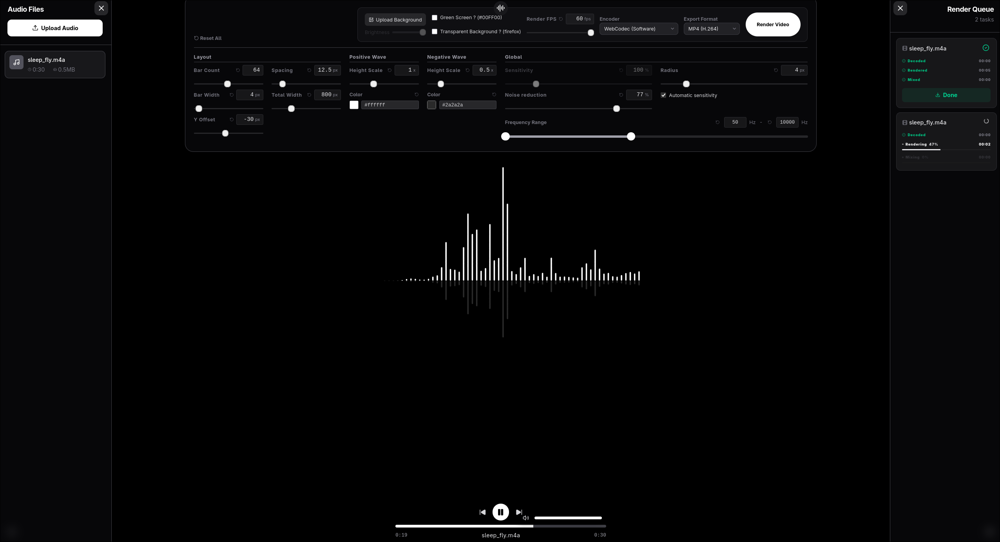

# Audio Spectrum Renderer

> Upload an audio file, tweak the spectrum look, and export it as a video — all in the browser.



Live Demo: <https://audio-spectrum-renderer.pages.dev>

## Try It in 30 Seconds

1. **Upload** an audio file.
2. **Tweak** bars, colors, sensitivity, and background.
3. **Export** as MP4, WebM, or GIF.

## Output Formats

| Format | Transparency | Audio | Use it for |
| --- | --- | --- | --- |
| MP4 (H.264) | Green screen (`#00FF00`) for chroma keying | Yes, mixed in | Editing software, sharing anywhere |
| WebM (VP9) | Real alpha channel | Yes, mixed in | Overlays, web use |
| GIF | No audio | No | Short previews, sharing without sound |

The app detects VP9 + alpha support and shows availability in the export settings.

## Features

- **Real-time preview** — canvas-based spectrum visualizer.
- **Bars** — count, width, spacing, total width, Y offset, corner radius, positive / negative height and color.
- **Sound shaping** — sensitivity, automatic sensitivity (autosens), noise reduction, min / max frequency.
- **Background** — solid color, uploaded image (auto-cropped to 16:9, 1280x720, with dimming), green screen, or transparent.
- **Encoder** — hardware or software WebCodecs, with automatic capability detection.
- **UI** — English / 中文, responsive layout.

## How It Works

1. Video frames are rendered in a worker with mediabunny / WebCodecs (no sound yet, except WebM which encodes Opus audio directly).
2. MP4 output is mixed with the original audio via FFmpeg.wasm in the browser.
3. GIF output is converted via FFmpeg.wasm (capped at 15 fps).

Fixed output size is 1280x720. Requires a browser with WebCodecs (Chrome / Edge recommended) served over HTTPS or localhost.

## Development

Prerequisites: Node.js (LTS), pnpm.

```bash
git clone https://github.com/zylen-det/Audio-spectrum-renderer.git
cd Audio-spectrum-renderer
pnpm install
pnpm dev
```

Then open the URL shown by Vite (usually `http://localhost:5173`).

Tech stack: React 19 + TypeScript + Vite, Tailwind CSS + Motion, Web Audio API (spectrum algorithm references [cava](https://github.com/karlstav/cava)), mediabunny (WebCodecs), FFmpeg.wasm.
